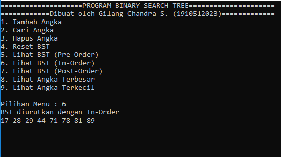

# BST-OpsProject

BST-OpsProject adalah sebuah projek akhir dari mahasiswa UPN "Veteran" Jakarta, Fakultas Ilmu Komputer, Program Studi S1 Sistem Informasi, 2019. Projek akhir ini dibuat untuk memenuhi syarat Ujian Akhir Semester di matakuliah Praktikum Struktur Data dan Algoritma.

## Deskripsi Program

Program ini adalah program yang dibuat untuk melakukan penyimpanan angka ke dalam BST dan mengoperasikannya. Kita dapat menambah, menghapus, dan mencari angka yang ada di BST yang terbentuk.

## Fitur-Fitur Program
Program ini menyediakan beberapa fitur seperti, menambah angka, mencari angka, menghapus angka, mereset angka, menampilkan angka secara Pre-Order, In-Order, dan Post-Order, serta menampilkan angka maksimal/minimal dalam BST. Pada saat program dijalankan, sudah ada beberapa angka yang diinputkan secara otomatis dari program. Angka-angka tersebut adalah : 71, 44, 81, 28, 78, 89, 17, 91

## Cara Penggunaan
Buka file program.exe untuk menjalankan program.
```
program.exe
```
Tampilan awal program adalah seperti ini di bawah ini.


Untuk menambah angka, pilih menu 1, lalu masukkan angka yang ingin ditambahkan.


Untuk mencari angka, pilih menu 2, lalu masukkan angka yang ingin dicari.


Jika angka yang dicari ada dalam BST, program akan menampilkan perkataan "DITEMUKAN" serta angka yang dicari dan simpul yang dilewatinya. Namun, jika angka yang dicari tidak ada dalam BST, program akan menampilkan perkataan "TIDAK DITEMUKAN" dan simpul yang dilewatinya.


Untuk menghapus angka, pilih menu 3, lalu masukkan angka yang ingin dihapus.


Jika angka yang ingin dihapus ada dalam BST, program akan menampilkan perkataan "Angka berhasil dihapus!" dan simpul yang dilewatinya. Namun, jika angka yang ingin dihapus tidak ada dalam BST, program akan menampilkan perkataan "Angka tidak ada dalam BST!" dan simpul yang dilewatinya. Proses penghapusan angka, tidak merusak struktur BST.


Untuk menampilkan angka yang diurutkan secara Pre-Order, pilih menu 5.


Untuk menampilkan angka yang diurutkan secara In-Order, pilih menu 6.



Untuk menampilkan angka yang diurutkan secara Post-Order, pilih menu 7.


Untuk menampilkan angka terbesar dalam BST, pilih menu 8.


Untuk menampilkan angka terkecil dalam BST, pilih menu 9.


Untuk mereset angka dalam BST, pilih menu 4.


Ketika data kosong dan kita ingin menggunakan menu 5 sampai 9, program akan menampilkan perkataan "Data kosong!" Sebagai contoh, saya akan coba menjalankan menu 6 di saat data kosong.


## Biodata Pembuat
NIM   : 1910512023

Nama  : Gilang Chandra S.

Email : gilangchandra9@gmail.com

